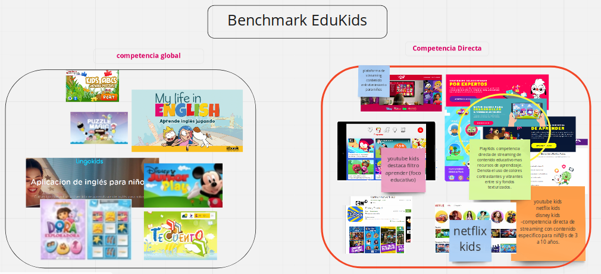
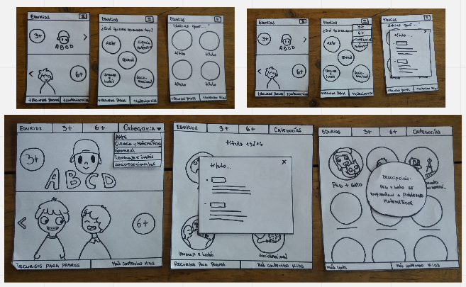
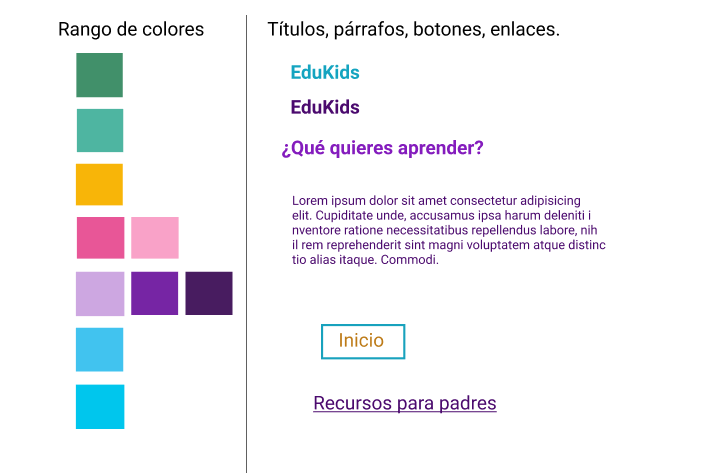
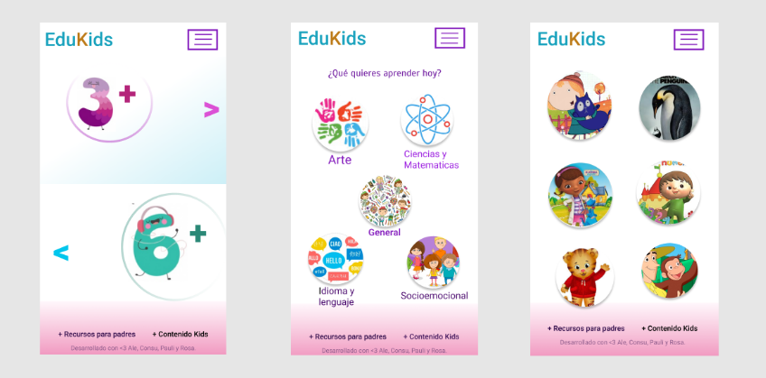
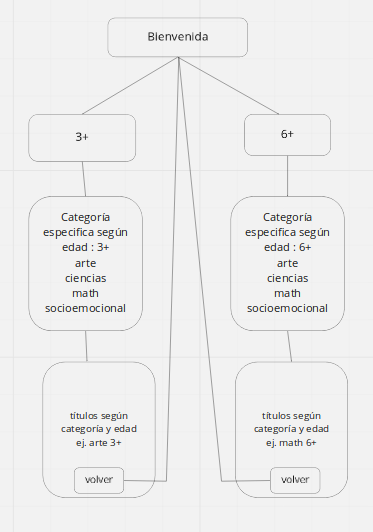

 # EduKids

### Investigacion de Usuario

# Research

Como equipo llegamos al acuerdo de realizar una aplicación con contenido educativo orientado a niños de 3 a 10 años. 

Comenzamos realizando una investigacion de mercado analizando tanto a nuestra competencia directa como global.   

Dentro de nuestra competencia directa encontramos aplicaciones como:
+ netflix  
+ playkids
+ disney 
+ youtube kids

 Al observar estos productos digitales,    podemos destacar la utilización de colores vibrantes como rojos,  amarillos,  verdes,   calipsos. Estructuras UI clasicas de diseño horizontal y exponiendo la navegación.

 Al observar a nuestra competencia global podemos conluir que el lenguaje visual utilizado es bastante similar orientado a colores y dibujos.  Además de destacar aplicaciones de aprendizaje de idiomas, lenguaje y otras.

 # Protopersona

 ## Nuestro Usuario Ideal

 Definimos algunos tipos de usuarios,  con el fin de contrastar difentres casos de uso de nuestra aplicación.

 1.  Javiera 
 + 28 años
 + madre soltera
 + cineasta
 + independiente
 + empoderada 
 + nivel educativo educación superior completa
 + amante del cine
 + usa netflix para su hija
 + muy proactiva
 + muy tech
 + muy organizada

 Desea que su hija de 5 años reciba una orientación de entretención educativa.

 2. Raúl

 + 30 años
 + sicologo
 + vive con su hermana
 + le gustan los juegos
 + trabaja en una escuela
 + usa netflix al buscar contenido para sus sobrinas de 4 años 
 + amante del anime

 Gusta de compartir con sus sobrinas una buena pelicula de niños.

 ## Casos de Uso

 Acontinuación describimos casos de uso, para situarnos en los momentos en que nuestra aplicación tuviese opcion de ser usada.

 #### Primer caso

 Javiera esta sola cuidando a su hija de 5 años, debe trabajar al menos 1 hora.    Javiera es feminista y no se siente cómoda con ciertos estereotipos clasicos entregados por la industria del entretenimiento infantil,   por lo que decide buscar alguna plataforma educativa de streaming.

 #### Segundo caso

 Raúl sicólogo tiene dos sobrinas de 4 años y debe cuidarlas todo el día,  sus sobrinas en un momento le piden ver televisión,  él accede pero siempre poniendo atención en escoger un programa educativo, entretenido y significante para ellas.  

 # MVP

 Comenzamos con la definicón de nuestro producto minimo viable donde se establecieron tres categorias para otorgar prioridad a la funcionalidades que se trabajaran primero.

 + Must (debe ir)
 
 filtro por edad

 filtro por categorias de educación

    arte

    ciencias

    matematicas

    lenguaje

    idioma

    socioemocional

+ Should (deberia tener)

busqueda por titulo

app para jugar

+ Nice (seria bueno)

red social

# Prototipo de Baja Fidelidad

Primera aproximación a lo que podría ser nuestra aplicación. 

### Testeo de Nuestro prototipo

Una vez realizado nuestro prototipo de baja fidelidad, se realizó un testeo para recibir feedback.

Nuestras conclusiones después de la primera iteración de diseño fueron las siguientes:

+ En la pagina de bienvenida en el sector del nav, dejar solo el logo, ya que segun los usuarios entrevistados, poner todas la información al principio provoca confusión.

+ En la página de Peliculas, las categorias deberían ir como botones, por que al ir el menú desplegable se esconde la información.

+ Las categorías de edad deberían tener un current que indique en que rango de edad esta situado el usuario.

[Test de nuestro prototipo de baja fidelidad](https://www.youtube.com/watch?v=WkYLFteWyO0&feature=youtu.be)

# Guía de Estilos

# Figma

Mobile First

La version desktop del prototipado se realizo con las mejoras que se detectaron despues del primer testeo con usuarios.

[Ve nuestro figma](https://www.figma.com/file/ejqGH8hR1BIJ445QlBelb1Xc/EduKids?node-id=9%3A3)

# Flujo de Usuario

Presentamos un esquema general del flujo que deberia tener un usuario al recorrer nuestra aplicación

